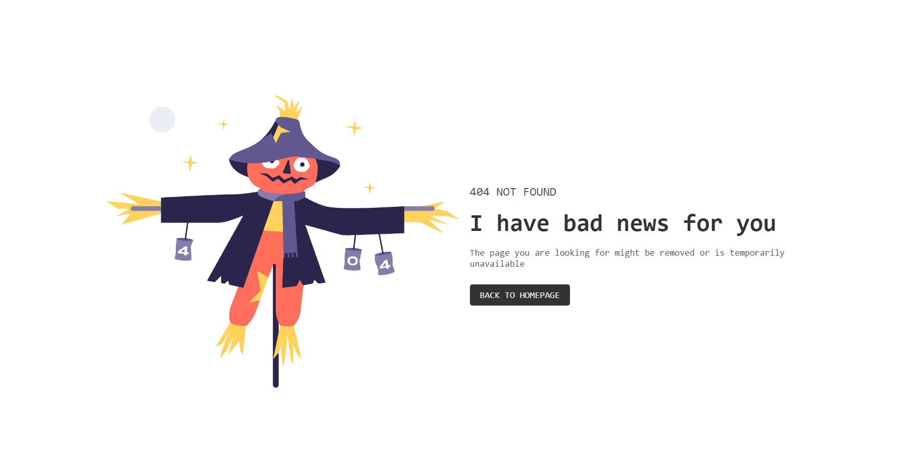
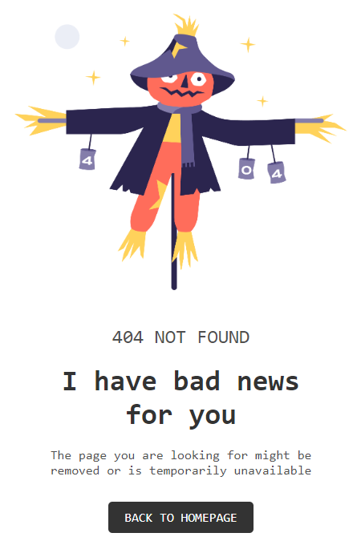

# Make It Real - 404 NOT FOUND PAGE

This is a solution to the 404-not-found-page project of the Make It Real course.

## Table of contents

- [Overview](#overview)
  - [The challenge](#the-challenge)
  - [Screenshot](#screenshot)
- [My process](#my-process)
  - [Built with](#built-with)
  - [What I learned](#what-i-learned)
  - [Continued development](#continued-development)
  - [Useful resources](#useful-resources)
- [Author](#author)
- [Acknowledgments](#acknowledgments)


## Overview

### The challenge

Users should be able to:

- Understand and apply margin and padding settings on the main window.
- Differentiate between `box-sizing: border-box` and `content-box`.
- Define font family, background color, and text color.
- Use Flexbox to vertically align and position blocks.
- Create responsive design for both desktop and mobile.

### Screenshot





## My process

### Built with

- Semantic HTML5 markup
- CSS custom properties
- Flexbox for layout
- Responsive design (mobile-first workflow)

### What I learned

While working on this project, I learned how to effectively use Flexbox to align and distribute elements, both vertically and horizontally. Additionally, I enhanced my understanding of creating responsive layouts that adapt to both desktop and mobile screens. Here's an example of how I used Flexbox for vertical alignment:

```css
.container {
  display: flex;
  flex-direction: column;
  justify-content: space-between;
  align-items: center;
  height: 100vh;
}
```

If you want more help with writing markdown, we'd recommend checking out [The Markdown Guide](https://www.markdownguide.org/) to learn more.

### Continued development

In future projects, I plan to continue refining my knowledge of Flexbox and CSS Grid to better handle complex layouts. Additionally, I would like to focus more on accessibility features to ensure that my web designs are usable for all users.

### Useful resources

- [Conceptos básicos de flexbox](https://developer.mozilla.org/es/docs/Web/CSS/CSS_flexible_box_layout/Basic_concepts_of_flexbox) - This helped me to vertically sort the blocks.
- [Box sizing](https://developer.mozilla.org/es/docs/Web/CSS/box-sizing)
- [Grid Layout](https://developer.mozilla.org/es/docs/Web/CSS/box-sizing) - It helped me sort the blocks into two columns
- [Uso de Media Queries](https://developer.mozilla.org/es/docs/Web/CSS/CSS_media_queries/Using_media_queries) - It helped me define styles according to screen size.

## Author

- Github - [william lupaca](https://github.com/PunoBootcamper)


## Acknowledgments

Thanks to the Make It Real course for providing this challenge and the helpful resources that guided me throughout the process.